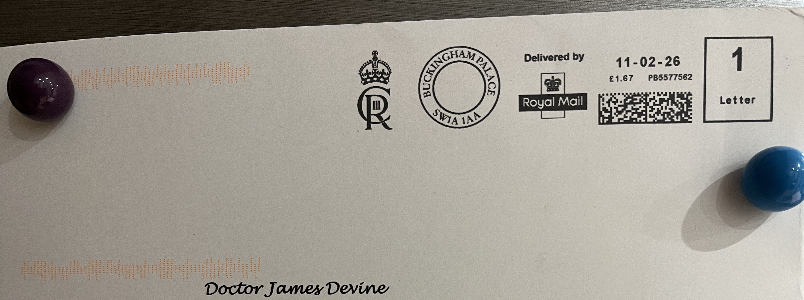
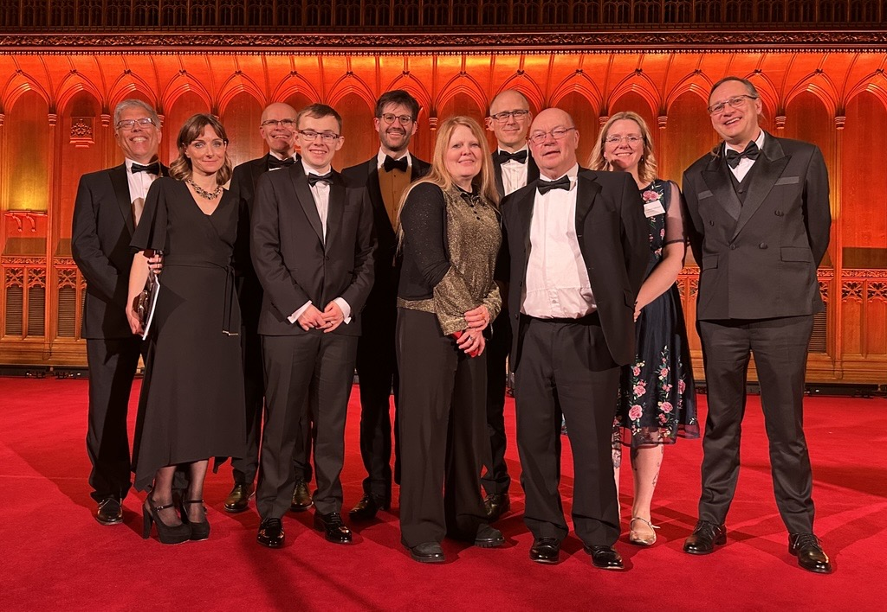

In the 10th year of the micro:bit, I received a letter in the post.

The letter contained an invitation to the awards ceremony for the Queen Elizabeth Prizes for Higher Education at St. James' Palace and a black tie dinner at Guild Hall, London. The Queen Elizabeth Prize for Higher Education recognises exceptional contributions that have transformed higher education and delivered lasting benefits to students, institutions, and society. I was invited to receive the award on behalf of Lancaster University, a founding partner of the micro:bit project. The university recognised and remembered my significant contributions to the micro:bit project.

You will have to take my word for it that I went to the palace. No images are allowed to be shared from the event, but the ceremony live stream _was_ available. I snapped an image from it of the back of my head (red circle)!

The Guild Hall dinner was amazing too - here is a picture of the Lancaster University and micro:bit cohort on the stage at the front of the hall.

## The micro:bit and me

The [micro:bit](https://microbit.org) project has been a significant part of my life since 2015. Back then, I co-wrote the [micro:bit runtime](https://github.com/lancaster-university/microbit-dal) with my PhD supervisor Joe Finney. The runtime's main job was to use hardware resources efficiently while enabling an intuitive user experience. This led to a "block first" development approach where large portions of the runtime's implementation were informed by how the blocks should look in [MakeCode](https://makecode.com). 

The real genius of the runtime is its event-driven and non-preemptive core. Joe made this key decision early on emphasising the need to hold teachers and students at the forefront of our mind throughout development. These two properties make user program behaviour easy to reason about and explain. This also helps the runtime bridge the semantic gap between MakeCode's development language, JavaScript, and the hardware.

Working on the runtime, building micro:bit devices, and watching others do so revealed another barrier: extending the micro:bit's functionality. It is an extremely capable device already, but integrating it with other electronics peripherals to build devices is challenging. Complexities span electronics understanding to wiring to programming. The micro:bit has an easy-to-use physical interface, the edge connector, but peripherals are often wholly consuming and non composable. 

Enter Jacdac: a plug-and-play protocol for low-cost microcontrollers. Jacdac facilitates a USB-like experience where users simply plug hardware modules together using a specially designed connector and cable. Device drivers are automatically discovered and specifications allow programming interfaces to be automatically derived and injected, for example, into MakeCode. The protocol is now supporting extensible plug-and-play hardware experiences for the micro:bit around the world.

A decade has now passed since the launch of micro:bit. The mission of empowering everyone to live their best digital futures continues and is in the extremely competent hands of the Micro:bit Educational Foundation. It is astonishing how much impact the micro:bit has had around the world. 2% of all children in the world have used a micro:bit. I am extremely grateful for the opportunities presented to me because of my work on the micro:bit; it truly has enabled my best digital future. I now get to use the micro:bit to realise my sons' best digital future.

