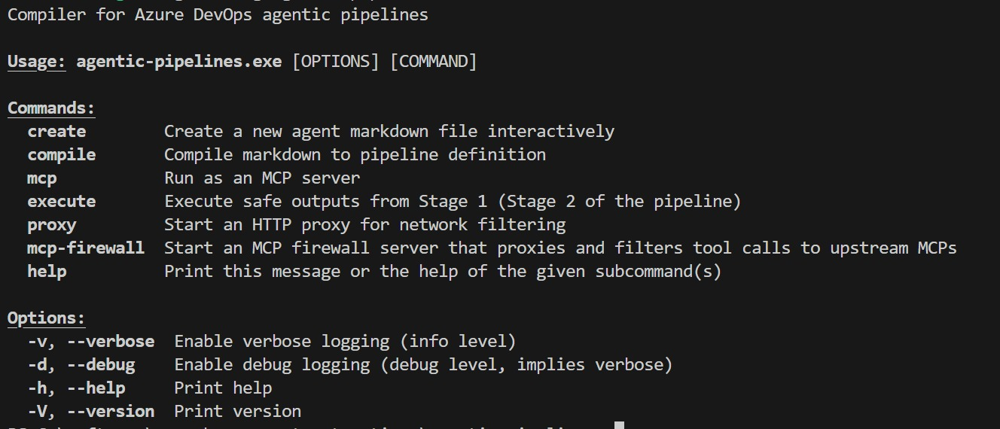
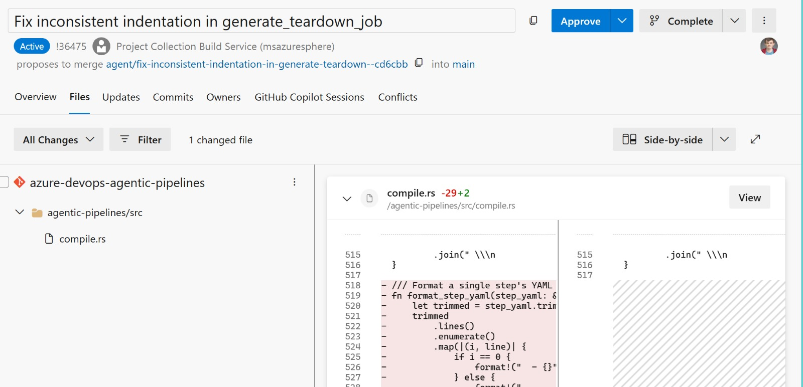

[GitHub agentic workflows](https://github.github.com/gh-aw/) is a pretty neat idea: agents that safely execute in a pipeline environment and perform routine tasks. Unfortunately, agentic workflows only supports GitHub actions. What would it take to recreate the concept in Azure DevOps? It turns out: just me, my friend Claude (Opus 4.5), and time—oh! And persistence, though that is assumed when you spend time on CI/CD pipelines.

> **Note:** having agents operate in a pipeline context with full access to an Azure DevOps instance would be irresponsible. This was never allowed at any point. This is also a pet project / research investigation. It will likely never see the light of day.

There are four key pipeline jobs in Agentic Pipelines, mirroring that of the agentic workflows:

* **Setup** - Preprocessing jobs that a user may optionally specify.
* **Agent execution** - Agent completes the task specified by the user, optionally using outputs from the Setup job. The agent produces "safe outputs" that are later evaluated.
* **Threat detection** - Safe outputs are analysed for threats e.g. prompt injection, DDOS, directory traversal attacks.
* **Safe output execution** - Having been deemed safe, the outputs are executed. There is no agent involvement here. Outputs are evaluated against the contract, specified in the original definition.

The key innovation is the separation of agent action from execution. When both are combined, agentic execution cannot be audited or analysed. In a separate two stage process it can!

The task and constraints for the pipeline are specified in a markdown document and leverage markdown frontmatter to configure pipeline aspects. Here is an example markdown document for my copilot instructions reviewer:

```
---
name: "Copilot instruction reviewer"
description: "Reviews discrepancies between instructions and the codebase"
triggers:
  pipeline:
    name: "Build Agentic Pipeline Compiler"
    branches:
      - main
safe-outputs:
  create_pr:
    target_branch: main
    auto_complete: false
    delete_source_branch: true
    squash_merge: true
    reviewers:
      - "James Devine"
    labels:
      - agent-created
      - automated
---

## Copilot instruction reviewer

You are responsible for ensuring the documentation in ⁠ .github/copilot-instructions.md ⁠ accurately reflects the actual implementation in the codebase.

### Analysis Process

1.⁠ ⁠*Read the instructions file*: Start by reading ⁠ .github/copilot-instructions.md ⁠ thoroughly
....
```

## Security

Even with the flow above, there are still ways to exploit the agent. For example, a malicious mcp could inject the prompt of the agent and have it leak secrets to a server. Or the agent could be poisoned and produce thousands of work items and PRs. We want to limit the possible damage. Enter: firewalling!

Firewalls are deployed at two levels:

* **network:** Allow only expected network calls by the agent. By default, just the copilot endpoints. Additional endpoints must be allow listed.
* **mcp:** Allow only a subset of tools by the agent. Defaults to `ls`, `cat`, and a few other shell commands, plus any specified safe outputs.

The mcp firewall also has the side benefit of _reducing_ the choices the agent can make. For example, if the agent is supplied with too many tools or ones it cannot use (e.g. azure devops mcp with no token), the results can be disappointing. Reducing choice, in my experience, leads to greater success.

## Safe outputs

Safe outputs are a contract between the frontmatter of the pipeline definition, and the execution model. The front matter specifies the permitted safe outputs and their constraints:

```
safe-outputs:
  create_pr:
    target_branch: main
    auto_complete: false
    delete_source_branch: true
    squash_merge: true
    reviewers:
      - "James Devine"
    labels:
      - agent-created
      - automated
```

The `create_pr` safe output has an implicit allowed repositories list of "self". The rule this translates to at execution time is: _create a pr for self with main as base_. Any other repository reference is dropped.

The agent is provided with the `safeoutputs` mcp with the safe-outputs specified by the user. When the `create_pr` tool is called, it generates a patch file, and a jsonl entry in the safe outputs file with details for the PR:
```
{
    "title": "A neat code change",
    "description": "This is a really simple code change that you missed when writing the tool, you silly billy!",
    "repository": "self",
    "patch": "name-of-patch-file.patch"
}
```

Each safe output also has a maximum number of outputs. In all cases, the default is one, and this can be raised in the front matter by the user. At threat detection time, the safe output count for each is evaluated and entries over the threshold are removed.

## The compiler

A simple command line tool takes the markdown + frontmatter and turns it into a pipeline yaml definition. The CLI has commands that are used during agent and safe output execution:




## Using agentic pipelines to build agentic pipelines

Once I had the basic work item output safe output working:

```
safe-outputs:
  create_work_item:
    work_item_type: Task
    assignee: "James Devine"
    tags:
      - agent-created
      - automated
      - copilot:repo=azure-devops-agentic-pipelines@main
```

My pipelines were able to create work items that I could review and then assign to Github Copilot. A few minutes later, and I would have PRs ready that improved the code quality, added tests or fixed fundamental problems in the code for the project. Having the PR safe output going accelerated this process even further:



## Safe Azure DevOps access?

I am not going to solve Azure DevOps access token scope. But given the security issues around supplying the agent with unfettered access to Azure DevOps, how do I make Agentic Pipelines _useful_? Enter... **hooks**!

The hooks allow you to preprocess data for the agent to consume (the setup phase for agentic workflows). This gives the pipeline creator fine grained access control over what data the agent can see.

With hooks implemented, I was able to download agent generated pipeline failure summaries across the project for the past N days. The pipeline summarises the summaries and gives a brief overview of what actions I should take, assigned as an Azure DevOps work item - yippee!

```
---
name: "Release Readiness"
description: "Given summaries, highlight common issues and identify action items to resolve ongoing issues"
schedule: daily around 9am
setup:
  - task: PipAuthenticate@1
    displayName: "Authenticate to Python Package Feed"
  - bash: |
      export UV_DEFAULT_INDEX=$PIP_INDEX_URL
      export UV_EXTRA_INDEX_URL=$PIP_EXTRA_INDEX_URL
      python -m pip install uv
    displayName: Install pre-requisites
  - bash: uv run {{ workspace }}/agents/scripts/download-summaries.py --output $(Agent.TempDirectory)/summaries --days 5 --definitions 85,1076,105,107,110,464,1084,84,363,576,584,1083
    displayName: Run download summaries script
    env:
      SYSTEM_ACCESSTOKEN: $(System.AccessToken)
  - publish: $(Agent.TempDirectory)/summaries
    artifact: failure-summaries
prepare:
    - download: current
      artifact: failure-summaries
    - bash: |
        mkdir {{ workspace }}/failure-summaries
        cp -r $(Pipeline.Workspace)/failure-summaries  {{ workspace }}/failure-summaries
safe-outputs:
  create_work_item:
      work_item_type: Task
      assignee: "James Devine"
      tags:
        - agent-created
        - automated
---

## BVT Triage Summary

You are an expert build and test analyst. Your task is to analyze recent BVT (Build Verification Test) pipeline failures and provide actionable insights.

### Context

The ⁠ ./failure-summaries ⁠ directory contains triage summary files from failing pipeline runs over the last 5 days. Each file represents a failed build and contains:
•⁠  ⁠Test failures and error messages
•⁠  ⁠Build configuration details
•⁠  ⁠Potential root causes identified by automated triage

....

```

## What did I learn?

Before: I'd notice a doc was stale, add it to my mental backlog, and forget. Now: an agentic pipeline notices, files a PR, and I review it over coffee. The agents don't make the work disappear--they make it show up.

## What's next?

Agents thrive on routine. But the interesting problems aren't routine—they span days, require context, need judgment calls. Pipelines are stateless; agents need memory. That's the next problem I am going to tackle with this work: incrementally completing a long running task (e.g. pipeline refactor) over a number of days.